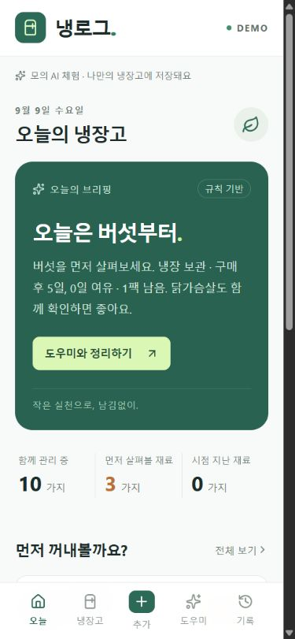

# 냉로그

구매 기록을 재고로 바꾸고, 오늘 먼저 사용할 재료를 알려주는 모바일 냉장고 관리 웹앱.

## 체험

[기존 비공개 데모](https://naenglog-fridge.vk4yrj847p.chatgpt.site). 현재 본인만 접근 가능하며, 최신 D1 버전 배포 상태는 RESUME_STATE.md에서 확인한다.

1. 오늘의 브리핑에서 먼저 살펴볼 재료를 확인한다.
2. 구매 추가에서 직접 입력 또는 영수증/온라인 캡처를 선택한다.
3. 분석 결과의 이름·수량·날짜·보관을 확인하고 등록한다.
4. 도우미에 “계란 3개 썼어”를 입력하고 변경을 확인한다. 같은 이름의 재고가 여러 개면 상세에서 선택한다.
5. 냉장고 상세에서 보관 변경, 수량 조정, 소비·폐기를 기록한다.
6. 새로고침 후 저장된 재고와 기록을 확인한다.

**외부 AI API와 실제 OCR은 연결하지 않았다.** 이미지 분석은 사진과 무관한 샘플 4개를 반환하며 화면에 명시한다. 텍스트·명령·브리핑은 규칙 기반이다. 예상 사용 시점은 검증 전 데모 정책으로 식품 안전 판단을 대신하지 않는다. 이미지 원본은 브라우저를 떠나지 않는다.

## 실행

Node 22.13 이상과 npm을 사용한다.

```sh
npm ci
npm run db:migrate:local
npm run dev
```

로컬 D1은 .wrangler/state에 저장된다. wrangler.local.json의 ID는 로컬 실행 전용 자리표시자이며 실제 클라우드 DB 식별자가 아니다. 운영 DB는 Sites의 DB 바인딩과 drizzle 마이그레이션으로 제공한다.

```sh
npm test
npm run typecheck
npm run lint
npm run build
npm audit --omit=dev
```

스키마 변경 후 npm run db:generate로 새 마이그레이션을 만들고 적용한다. 이미 적용된 SQL은 수정하지 않는다. lint는 직접 작성한 코드 대상이며 lint:all은 템플릿 전체를 검사한다.

## 구조

React 19 / TypeScript / Vinext / Cloudflare Workers + D1. 비동기 AIProvider → 응답 검증 → 사용자 확인 → 도메인 처리 → 서버 저장 순서다. 수량·날짜·거래 계산은 일반 코드가 담당한다.

HttpOnly 익명 세션 쿠키로 냉장고를 구분하고 DB에는 세션 해시를 저장한다. 구매·재고·분석·거래를 포함한 스냅샷을 revision 조건부 갱신으로 함께 저장한다. 충돌 시 최신 상태를 다시 불러오며 동일 요청 재전송은 수량을 다시 차감하지 않는다. 기존 localStorage 데이터는 검증 후 한 번 가져오며 원본은 백업으로 유지한다.

## 검증 및 남은 범위

2026-09-09: 테스트 21개, 타입검사, lint, 운영 빌드 통과. 실제 SQLite로 세션 격리·동시 수정·재전송·가져오기를 검증했다. 브라우저에서 구매→소비→새로고침 유지→냉동 변경, 이미지 선택→모의 분석→4개 등록을 확인했다. [검증 기록](docs/QA.md)을 참고한다.

운영 의존성 audit 0건. 전체 audit은 Drizzle 개발 도구의 전이 의존성 관련 moderate 4건으로, 개발 서버를 공개하지 않는다. 강제 의존성 변경은 적용하지 않았다.

계정 복구·기기 간 동기화·자동 브라우저 회귀 검사·식품 정책 근거 검토·제출 자료는 남아 있다. 쿠키를 삭제하면 기존 익명 냉장고를 복구할 수 없다. 저장 기록의 자동 만료/정리 정책도 후속 작업이다. 공개 심사용 전환은 이전 자동 승인 검토에서 명시적 공개 대상 승인이 부족해 거절되었다.



제품 정의: PROJECT.md / PRODUCT_SPEC.md. 구조: ARCHITECTURE.md. AI 계약: AI_PROVIDER_SETUP.md. 재개 지점: RESUME_STATE.md / TASK_QUEUE.md.

## 공식 소스 저장소
https://github.com/jwjeong-825/naenglog · main 브랜치. GitHub는 공식 코드/문서 기록, Sites는 별도 배포 환경이다.


## 제출 대표 경험 개선
오늘 브리핑의 판단 이유에서 해당 재료 상세와 소비/보관 기록으로 바로 연결한다. 구매 분석은 원본 상품→정규화 식재료→포장/중량/보관 후보→사용자 확인 순서다. 샐러드 등 완제품은 임의 분해하지 않는다. 상품별 확인 전 등록을 막고 미확인 정보는 null로 보존한다. 현재 23개 테스트가 통과했으며 상세 계약은 PRODUCT_SPEC.md 및 AI_PROVIDER_SETUP.md에 있다.

